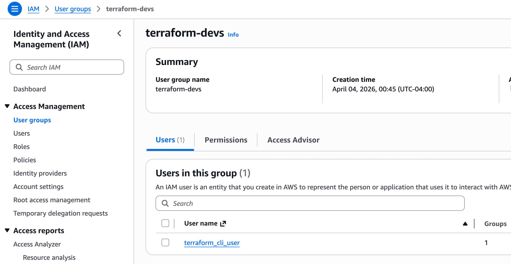
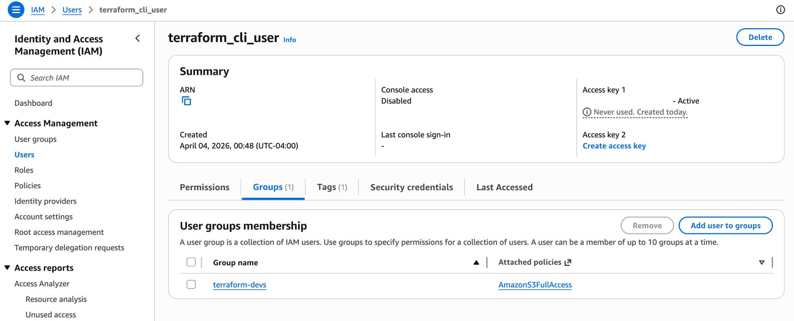
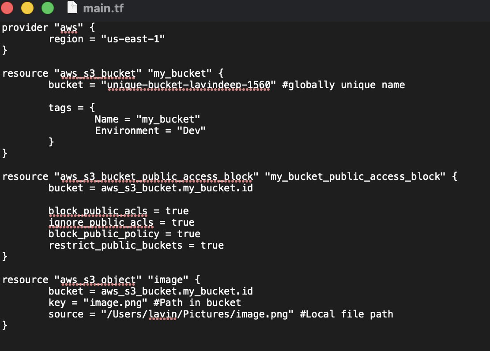
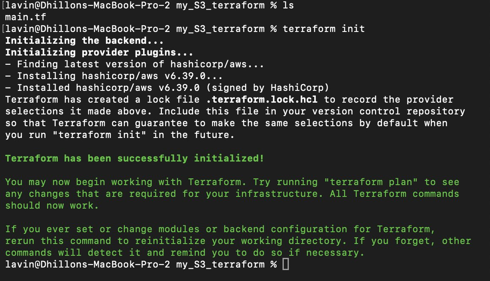
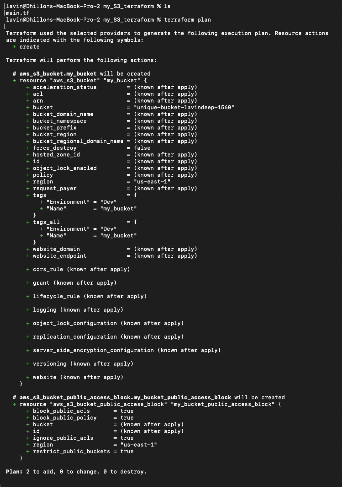
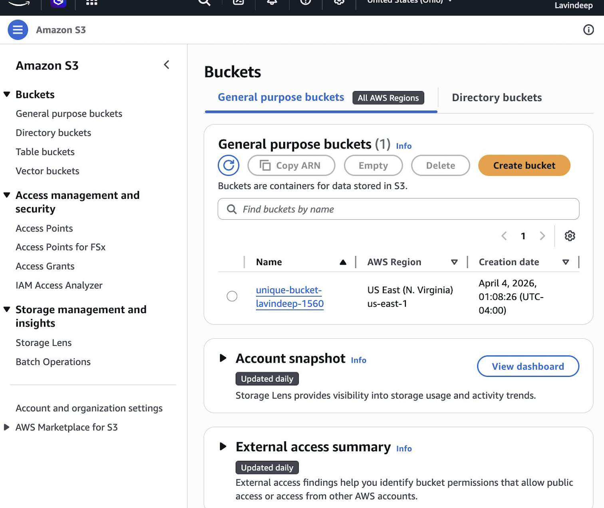
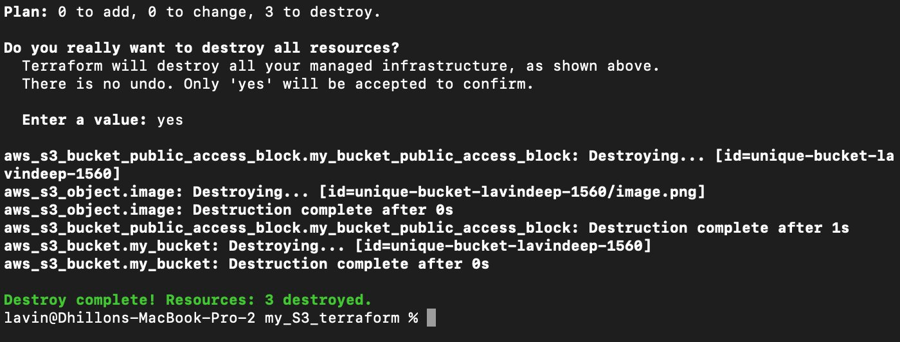
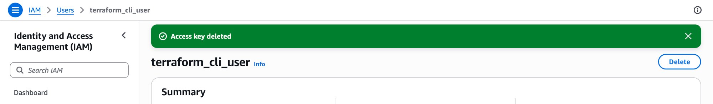

# S3 Deployment with Terraform

Deploys a secured S3 bucket on AWS using Terraform with public access restrictions, resource tagging, object uploads, and a dedicated least-privilege IAM user — all managed through infrastructure as code.

**Author:** Lavindeep Dhillon

---

## Architecture

```
┌─────────────────────────────────────────────────────┐
│  Terraform (IaC)                                    │
│                                                     │
│  ┌───────────────┐    ┌──────────────────────────┐  │
│  │  IAM Group    │    │  S3 Bucket               │  │
│  │  terraform-   │    │  unique-bucket-lavindeep  │  │
│  │  devs         │    │                          │  │
│  │  ┌──────────┐ │    │  • Public access blocked │  │
│  │  │ IAM User │ │    │  • Tagged (Name, Env)    │  │
│  │  │ terraform│ │    │  • Object: image.png     │  │
│  │  │ _cli_user│ │    │                          │  │
│  │  └──────────┘ │    └──────────────────────────┘  │
│  │               │                                  │
│  │  Policy:      │                                  │
│  │  AmazonS3Full │                                  │
│  │  Access       │                                  │
│  └───────────────┘                                  │
└─────────────────────────────────────────────────────┘
```

---

## IAM Configuration

Created a dedicated IAM user and group scoped to S3 permissions only, rather than using root or admin credentials.

- **Group:** `terraform-devs` with `AmazonS3FullAccess` policy attached
- **User:** `terraform_cli_user` added to the group





> **Note:** Access keys were configured via `aws configure` and never committed to version control. Keys were deleted after project completion.

---

## Terraform Configuration

The `main.tf` defines four resources: the AWS provider, the S3 bucket with tags, a public access block, and an object upload.

```hcl
provider "aws" {
  region = "us-east-1"
}

resource "aws_s3_bucket" "my_bucket" {
  bucket = "unique-bucket-lavindeep-1560"

  tags = {
    Name        = "my_bucket"
    Environment = "Dev"
  }
}

resource "aws_s3_bucket_public_access_block" "my_bucket_public_access_block" {
  bucket = aws_s3_bucket.my_bucket.id

  block_public_acls       = true
  ignore_public_acls      = true
  block_public_policy     = true
  restrict_public_buckets = true
}

resource "aws_s3_object" "image" {
  bucket = aws_s3_bucket.my_bucket.id
  key    = "image.png"
  source = "/Users/lavin/Pictures/image.png"
}
```



---

## Deployment

Ran the standard Terraform workflow: `init` → `plan` → `apply`.

**Initialization** — downloaded the AWS provider plugin and set up local state:



**Plan** — previewed 2 resources to be created (bucket + public access block; the object was added in a subsequent apply):



**Result** — bucket deployed to `us-east-1` and verified in the AWS console:



---

## Teardown

Destroyed all managed resources and deleted the IAM access key to leave no active credentials behind.





---

## Prerequisites

- [Terraform](https://developer.hashicorp.com/terraform/downloads) installed
- [AWS CLI](https://aws.amazon.com/cli/) configured with a scoped IAM user
- An AWS account

---

## Usage

```bash
git clone https://github.com/lavindeep/s3-terraform.git
cd s3-terraform
terraform init
terraform plan
terraform apply
```

To tear down:

```bash
terraform destroy
```

---

## .gitignore

```
.terraform/
*.tfstate
*.tfstate.backup
*.tfvars
```
